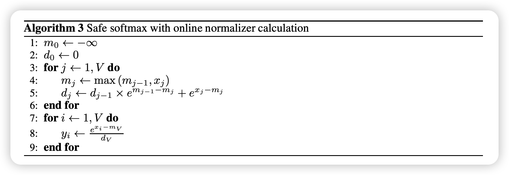

This Repository contains some Jupter Notebooks to help me and you to understand the key concepts in the AI field. It range from basic machine learning algorithms, to the deep neural network in the computer vision and natural language processing. It also includes concepts such as LLM training and fine-tuning, reinforcement learning, meta-learning and and so on. 

- [Optimizers](#optimizers)
- [Online Softmax](#online-softmax)

## Optimizers


## Online Softmax 

Online softmax as proposed in the [Online normalizer calculation for softmax](https://arxiv.org/pdf/1805.02867) is a technique to compute the softmax function in an online manner. It tackles two key problems in the deep learning:
1. **Memory Efficiency**: Traditional softmax requires storing all logits in memory, which can be prohibitive for large models or batch sizes. Online softmax, on the other hand, updates the softmax normalization term incrementally, allowing it to operate with a constant memory footprint.
2. **Numerical Stability**: The online formulation keeps track of the maximum value seen so far and rescales the running sum accordingly.This prevents the exp function from overflowing or underflowing, which is especially important in mixed precision training (FP16/BF16).

The core idea behind online softmax is behind the math fact that:
$$
e^{x_i} = e^{m} \cdot e^{x_i - m}, \quad e^{m_{\text{old}}} / e^{m_{\text{new}}} = e^{m_{\text{old}} - m_{\text{new}}}
$$
Below is the simple illustration of the online softmax function, for the full code, please visit this [notebook](https://github.com/YYZhang2025/AI-Notebooks/blob/main/online_softmax.ipynb)

```Python
def softmax_online(x: np.ndarray):
    m = -np.inf
    z = 0.0

    for xi in x:
        if xi > m:
            m_new = xi
            z = np.exp(m - m_new) * z + np.exp(xi - m_new)
            m = m_new
        else:
            z += np.exp(xi - m)

    return np.array([np.exp(xi - m) / z for xi in x])
```

Online softmax is utilized in [Flash Attention](https://arxiv.org/abs/2205.14135) to reduce memory access overhead. For the implementation of Flash Attention, please visit the code [here](https://github.com/YYZhang2025/100-AI-Code/blob/main/05_flash_attention.ipynb). 